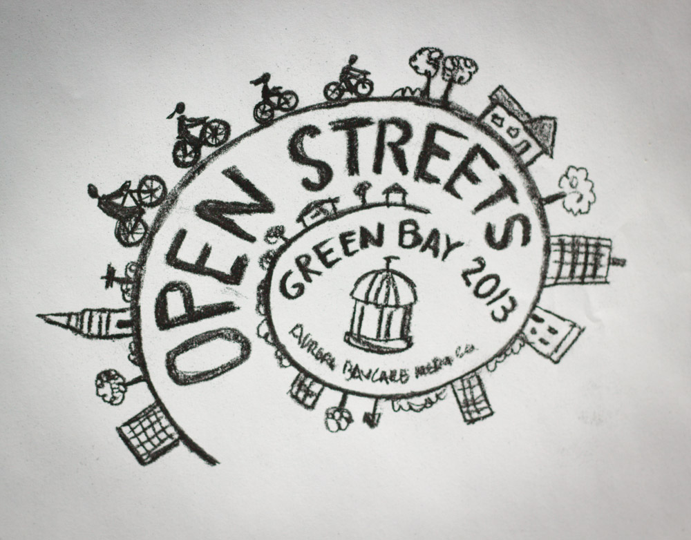

Open Streets is an annual non-profit event held in downtown Green Bay where the streets are closed to vehicle traffic, and opened for fun transportation alternatives, such as biking, walking, running, skating and more. Insight created the Open Streets logo to convey community, motion, fun and the open route of the one-day event.

{: .no-border }
{: .no-border }
{: .no-border }
{: .no-border }
{: .no-border }
{: .no-border }
